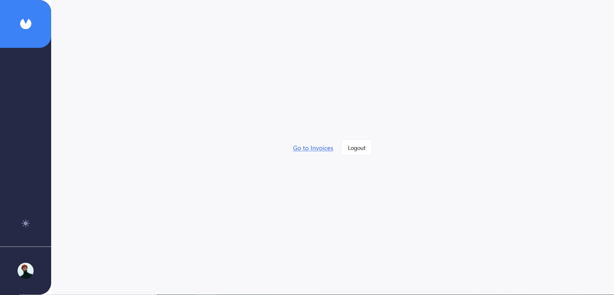

## Getting Started

First, run the development server:

```bash
npm run dev
# or
yarn dev
# or
pnpm dev
# or
bun dev
```

Open [http://localhost:3000](http://localhost:3000) with your browser to see the result.

You can start editing the page by modifying `app/page.js`. The page auto-updates as you edit the file.

# Invoicify

## Features

-   **CRUD Operations for Invoices:** Create, read, update, and delete invoices.
-   **Single Invoice Retrieval:** Get detailed information for a single invoice.
-   **Next.js Server Actions:** Efficient use of Next.js server actions for optimized server-side functionality.
-   **APIs with MongoDB and Mongoose:** Robust API integration using MongoDB as the database and Mongoose for object data modeling.
-   **Form Handling with React Hook Form:** Smooth and efficient form handling using React Hook Form.
-   **UI Components with Shadcn UI:** Modern and sleek UI components provided by Shadcn UI.

## Landing Page

<div style="display: flex;  justify-content: space-between;">
  
  
</div>

## Invoices Page

<div style="display: flex;  justify-content: space-between;">
  
  
</div>

## Single Invoice Page

<div style="display: flex;  justify-content: space-between;">
  
  
</div>

## Add Invoice


## Delete Invoice


